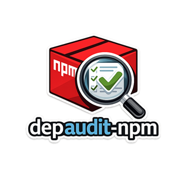

# depaudit-npm



`depaudit-npm` は、npm 関連の証拠ファイルを走査して、指定した package の痕跡を検出するクロスプラットフォーム対応の Go 製 CLI です。

`targets.txt` または `--targets-file` によって任意の package を検査できます。

`1.1.0` は現行の stable release です。

## 背景

2026年に発生した npm のサプライチェーン攻撃（`axios` / `plain-crypto-js`）をきっかけに、本ツールを開発しました。

当時、影響のあった時間帯にサンプルコードの作成やパッケージのビルドを行っており、自身の環境が影響を受けている可能性がありました。しかし、次の理由から「影響を受けているかどうか」を迅速に判断することができませんでした。

- 直接依存だけでなく、その先の依存関係も含めて確認する手段がない
- lockfile だけでは実体の有無が判断できない
- `node_modules` や cache を含めた横断的な調査が手作業になる

また、既存のツール（`Trivy` / `npm audit` / `osv-scanner` など）は脆弱性情報の検出には有効ですが、今回のような「特定の package が何らかの経路で存在していたか」を調査する用途には適していませんでした。

このような背景から、インシデント対応時に「痕跡ベースで package の存在を確認する」ことに特化したツールとして `depaudit-npm` を開発しました。

このツールは、特定の脆弱性ではなく「存在していたかどうか」という事実の確認を目的としています。

本ツールには、既定のターゲット定義ファイルとして、`axios` / `plain-crypto-js` のサプライチェーン攻撃を検知できる設定が含まれています。そのまま利用することで、当該インシデントの影響有無を即座に確認できます。

また、定義ファイルを変更することで、任意の npm パッケージに対する同様の検査を行うことができます。

なお、検査動作を確認するため、リポジトリにはサプライチェーン攻撃（`axios` / `plain-crypto-js`）に該当するテストデータが含まれています。通常の利用には影響しませんが、コードを参照する場合はその点にご注意ください。

主な配布形態は、実行ファイル、`targets.txt`、ドキュメント、
`THIRD-PARTY-NOTICES.md` を含んだプラットフォーム別の release archive
です。
各 archive には、Syft で生成した SBOM `SBOM.spdx.json` も含まれます。

## 主な機能

- Windows / Linux / macOS 対応
- `package-lock.json`、`npm-shrinkwrap.json`、`pnpm-lock.yaml`、`yarn.lock`、`bun.lock`、`package.json` の構造化解析
- 任意で `node_modules` 実体確認
- 任意で npm cache log 確認
- findings / coverage / projects を分けた出力
- `targets.txt` による既定ターゲット設定

## クイックスタート

1. 利用する OS 向けの `v1.1.0` release archive をダウンロードする
2. 任意のフォルダへ展開する
3. 既定の検査対象を変えたい場合は、同梱の `targets.txt` を編集する
4. 展開したフォルダ内のバイナリを実行する

Windows:

```powershell
.\depaudit-npm.exe
```

Linux:

```bash
./depaudit-npm
```

macOS:

```bash
./depaudit-npm
```

実行例:

カレントディレクトリを、既定の `targets.txt` で走査する:

```powershell
.\depaudit-npm.exe
```

特定パスを対象にする:

```powershell
.\depaudit-npm.exe --roots D:\src\myrepo
```

明示的な設定ファイルを使う:

```powershell
.\depaudit-npm.exe --targets-file .\custom-targets.txt --roots .
```

## ターゲット設定

既定のターゲット設定ファイル名は `targets.txt` です。
`--targets-file` を省略した場合は、まず実行ファイルの隣、次にカレントディレクトリから `targets.txt` を探します。

release archive には `targets.txt` がバイナリの隣に同梱されるため、展開直後から既定設定で実行できます。

書式は 1 行 1 package です。

```text
plain-crypto-js@4.2.1
axios@1.14.1
axios@0.30.4
@scope/pkg
```

`#` で始まる行はコメントとして無視します。

## 対応証拠ファイル

- `package-lock.json`
- `npm-shrinkwrap.json`
- `pnpm-lock.yaml`
- `yarn.lock`
- `bun.lock`
- `package.json`
- `--include-node-modules-folder-check` 指定時の `node_modules/<package>/package.json`
- `--include-npm-cache-logs` 指定時の npm cache logs

`bun.lockb` は未対応証拠源として検出し、`NeedsReview` で出力します。

## 出力ファイル

各実行で次のファイルを出力します。

- `npm_dependency_scan_<timestamp>.csv`
- `npm_dependency_scan_<timestamp>.findings.json`
- `npm_dependency_scan_<timestamp>.coverage.json`
- `npm_dependency_scan_<timestamp>.projects.json`

## 結果の読み方

まずはコンソール出力の要約を確認してください。

- `Overall assessment: Problem` は、対象 package の痕跡が具体的に検出され、問題として扱うべき結果です。
- `Overall assessment: NeedsReview` は、未対応証拠源、読込失敗、parse 失敗、cache log の参照などがあり、手動確認が必要な結果です。
- `Overall assessment: NoIssue` は、対応済みかつ正常に解析できた証拠源の範囲では、対象 package の痕跡が見つからなかったことを意味します。

確認の順番は次がおすすめです。

1. コンソールの `Overall assessment` と件数サマリを見る
2. `npm_dependency_scan_<timestamp>.findings.json` を開いて個別の検出内容を確認する
3. `npm_dependency_scan_<timestamp>.coverage.json` を開いて、未走査や未対応がないか確認する
4. モノレポや複数 root の場合は `npm_dependency_scan_<timestamp>.projects.json` で project ごとの差を見る
5. 表計算や共有用途では `npm_dependency_scan_<timestamp>.csv` を使う

各ファイルの役割は次のとおりです。

- `*.findings.json` は主出力です。`category`、`indicator`、`assessmentDetail`、`path`、`result` を確認してください。
- `*.coverage.json` は走査範囲の確認用です。`skippedPathCounts` や `unsupportedEvidenceSourceCounts` が空でない場合、その実行結果は完全ではありません。
- `*.projects.json` は project root ごとに findings をまとめ、各 project の最も強い結果を示します。
- `*.csv` は `findings.json` と同じ内容を表形式で出力したものです。

解釈上の注意:

- `Problem` が最優先で、他の結果よりも重く扱います。
- `NeedsReview` は必ずしも対象 package の存在確定を意味しません。無視せず人手で確認すべきという意味です。
- `NoIssue` は「正常に解析できた対応済み証拠源では見つからなかった」という意味であり、「どこにも存在しないことの証明」ではありません。
- `--strict` を使うと、coverage gap や未対応証拠源がある場合は `NoIssue` 相当の結果も `NeedsReview` に引き上げられます。

## ソースからビルド

```powershell
go build -o .\bin\depaudit-npm.exe .
```

## テスト

```powershell
go test ./...
```

## 追加ドキュメント

- [Setup](./docs/setup.md)
- [Development](./docs/development.md)
- [Third-party notices](./THIRD-PARTY-NOTICES.md)

通常利用では release archive を使ってください。ソースからのビルドは、開発や独自パッケージングが必要な場合だけを想定しています。

## ライセンス

MIT License です。詳細は [LICENSE](./LICENSE) を参照してください。
同梱依存のライセンス notice は
[THIRD-PARTY-NOTICES.md](./THIRD-PARTY-NOTICES.md) に記載しています。
Syft 生成の SPDX JSON SBOM は各 release archive に
`SBOM.spdx.json` として同梱されます。
